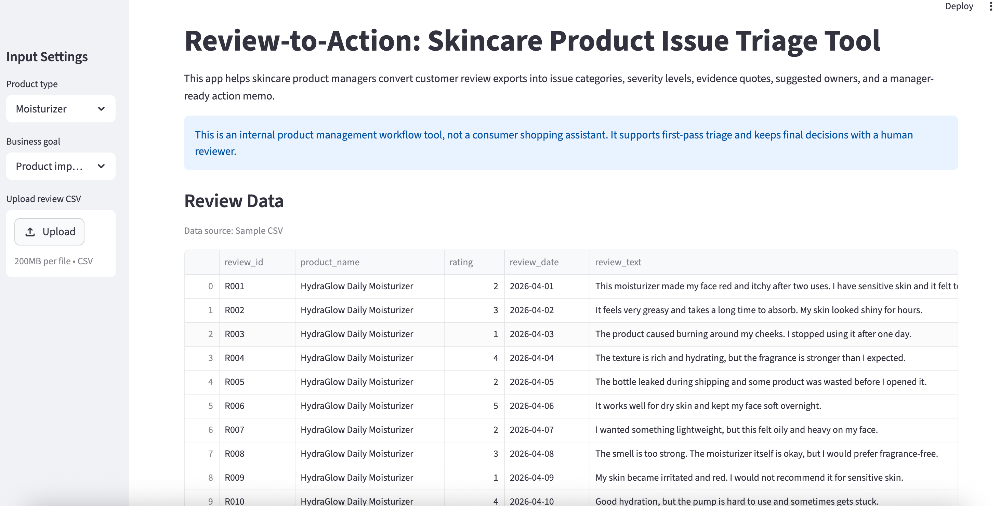
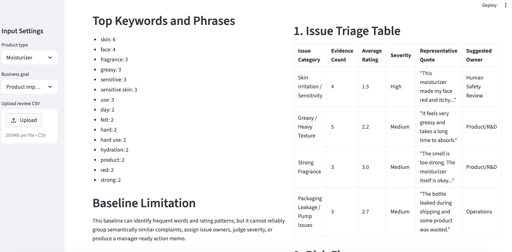
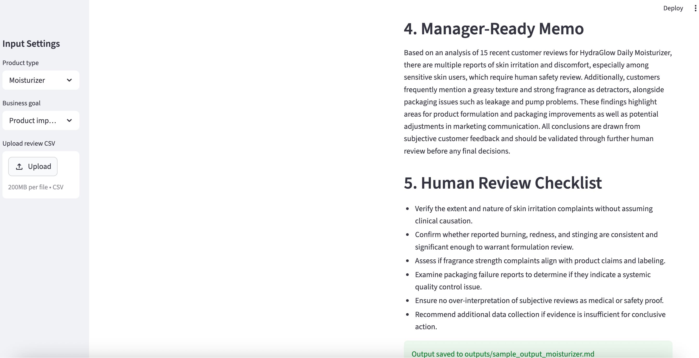

# Review-to-Action: A GenAI Product Issue Triage Tool for Skincare Reviews

## 1. Context, User, and Problem

Review-to-Action is a GenAI workflow tool for skincare product managers who need to review customer feedback and decide which product issues deserve follow-up.

The workflow starts with a CSV export of customer reviews and ends with an internal product issue memo. This matters because product teams often receive large amounts of unstructured review text. A product manager does not only need a general summary. They need to know which issues are repeated, how severe they appear, what evidence supports them, which team should review them, and where human judgment is still required.

The target user is a skincare product manager or product operations analyst.

The improved workflow is:

CSV review export -> issue categories -> severity levels -> evidence quotes -> suggested owners -> manager-ready action memo.

## 2. Solution and Design

The project is implemented as a Streamlit app. The user can upload a skincare review CSV or use the included sample review file. The app then generates two outputs side by side:

1. A keyword and rating baseline
2. A GenAI product issue triage report

The GenAI report includes:

- Product issue triage table
- Evidence count
- Average rating by issue
- Severity level
- Representative review quote
- Suggested owner
- Risk flags
- Recommended actions
- Manager-ready memo
- Human review checklist

The GenAI component is useful because customer reviews often describe the same issue in different language. For example, "burning," "redness," "stinging," "too harsh," and "not for sensitive skin" may all point to a similar irritation-related issue. A keyword baseline may treat these as separate terms, while the LLM can group them into a more useful product issue category.

This project intentionally avoids unnecessary complexity. It does not use RAG, agents, or multiple models because the workflow does not require them. Instead, it uses a focused prompt, low temperature, fixed output sections, and a simple Streamlit interface.

## 3. Difference from Rufus and ChatGPT

This project is not a consumer shopping assistant. Rufus-style tools help shoppers understand products before purchase. Review-to-Action supports an internal product management workflow after reviews have already been collected.

It also differs from a prompt-only ChatGPT workflow. Instead of asking the user to write a new prompt each time, the app uses a repeatable CSV input, fixed output fields, severity labels, evidence quotes, suggested owners, and human review boundaries. This makes the workflow easier to evaluate, compare, and audit.

## 4. Course Concepts Integrated

### Anatomy of an LLM Call

The app uses a system prompt, a controlled user prompt, low temperature, and fixed output sections. This helps the model produce a stable and repeatable report instead of a free-form summary.

### Evaluation Design

The project includes a small evaluation set and compares the app against simpler baselines. The evaluation focuses on issue grouping, evidence support, action usefulness, and human review boundaries.

### Governance and Human Review

The app is designed as a first-pass triage tool, not an automated decision system. It does not make final medical, safety, recall, or regulatory decisions. Safety-like complaints are flagged for human review.

## 5. Baseline Comparison

The main baseline is a keyword and rating summary. It outputs:

- Total review count
- Average rating
- Number of low-rating reviews
- Top keywords and bigrams

This baseline is useful for quick descriptive analysis, but it has important limitations. It can count frequent words, but it cannot reliably group semantically similar complaints, assign issue owners, judge severity, or produce a manager-ready action memo.

I also considered a prompt-only LLM baseline. A prompt-only workflow can produce useful summaries, but the output format is less consistent and depends heavily on the user's prompt quality. Review-to-Action improves this by turning the task into a repeatable app workflow.

## 6. Evaluation and Results

I evaluated the project on six synthetic skincare review scenarios. Each scenario represents a realistic review batch that a product manager might need to review.

The cases cover:

- Irritation, redness, greasy texture, and packaging leakage
- White cast, sticky feel, and strong smell
- Burning, redness, breakouts, and harshness
- Dryness and tight skin feeling
- Fragrance complaints and expectation mismatch
- Short, vague, emotional, or mixed feedback

Each output was scored from 0 to 2 on four dimensions:

| Dimension | Score Range | Meaning |
|---|---:|---|
| Issue grouping accuracy | 0-2 | Did the output group semantically similar complaints into useful product issue categories? |
| Evidence support | 0-2 | Did the output support each issue with review evidence or representative quotes? |
| Action usefulness | 0-2 | Did the output suggest useful owners, next steps, or escalation actions? |
| Human review boundary | 0-2 | Did the output clearly identify where a human should verify or make the final decision? |

Maximum score per case: 8.

The GenAI workflow performed best when the review batch contained repeated and concrete complaints, such as irritation, greasy texture, packaging leakage, or fragrance issues. It was stronger than the keyword baseline at grouping semantically similar complaints and turning them into action items.

The tool was weaker when reviews were vague, emotional, or mixed. In those cases, the app still produced a structured report, but the findings required more manual verification.

## 7. Artifact Snapshot

The repository includes:

- A working Streamlit app
- A sample skincare review CSV
- A keyword/rating baseline script
- A GenAI triage prompt
- A sample output report
- Evaluation cases and results

The app displays the uploaded review data, the baseline output, and the GenAI issue triage report side by side.

Screenshots of the working app are included in the screenshots folder. They show the input data, baseline output, GenAI issue triage table, risk flags, recommended actions, manager-ready memo, and human review checklist.

## 8. Setup and Usage

### Install dependencies

Run this command:

    pip install -r requirements.txt

### Set OpenAI API key

Do not commit your API key to GitHub. Set it locally in Terminal:

    export OPENAI_API_KEY="your_api_key_here"

### Run the app

Run this command:

    streamlit run app.py

The app will open in a browser. You can use the included sample CSV or upload your own CSV with the following columns:

    review_id, product_name, rating, review_date, review_text

Click "Run GenAI Triage" to generate the product issue triage report.

## 9. Repository Structure

    review-to-action/
    |
    |-- app.py
    |-- README.md
    |-- requirements.txt
    |
    |-- prompts/
    |   |-- triage_prompt.md
    |
    |-- data/
    |   |-- sample_reviews_moisturizer.csv
    |   |-- evaluation_cases.csv
    |
    |-- outputs/
    |   |-- baseline_output_moisturizer.md
    |   |-- sample_output_moisturizer.md
    |   |-- evaluation_results.md
    |
    |-- screenshots/
    |   |-- app_input_data.png
    |   |-- app_baseline_and_genai_start.png
    |   |-- app_issue_table.png
    |   |-- app_risk_actions.png
    |   |-- app_memo_checklist.png
    |
    |-- baseline/
        |-- keyword_rating_baseline.py

## 10. Limitations and Human Review Boundary

This tool should not be used as a medical, clinical, safety, recall, or regulatory decision system. Customer reviews are subjective and may contain exaggeration, sarcasm, spam, duplicated comments, or missing context.

The app is designed to support first-pass product issue triage. A human product manager should review the original comments before making product changes. Any safety-like complaint should be escalated to a qualified human reviewer before action is taken.

## Screenshots

### App Interface and Review Data

### GenAI Issue Triage Table

### Manager-Ready Memo and Human Review Checklist

